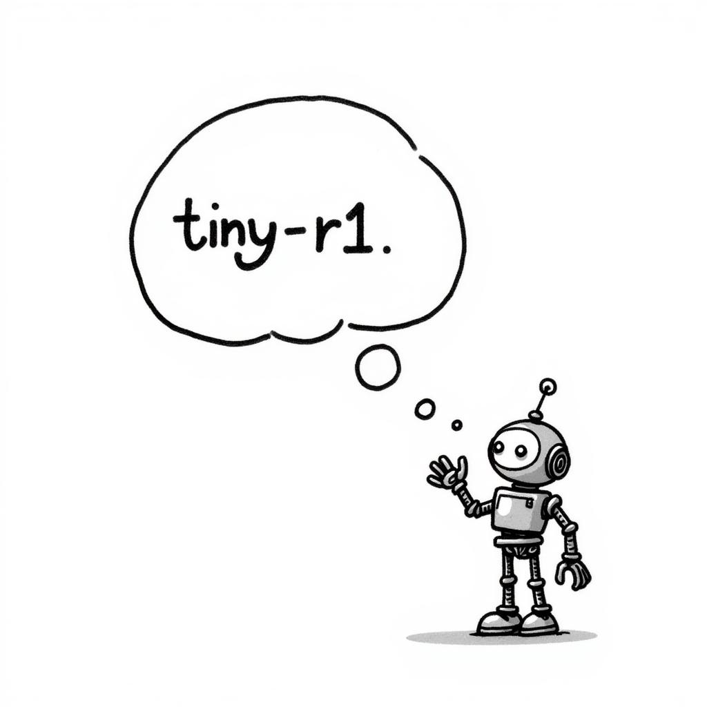

<p align="center">
  
</p>

# Tiny-R1

Recreating the DeepSeek-R1 GRPO reinforcement learning process. We process the [OpenAI GSM8K](https://huggingface.co/datasets/openai/gsm8k) dataset and train the model. We provide two training approaches:

1. [GPU Rich](#1-multi-gpu-training-acceleratedeepspeed)
2. [GPU Poor](#2-single-gpu-training-unsloth)

## Data Processing

Question:

```
Bob gets paid $5 an hour for the regular hours he works and $6 an hour for any overtime hours he works. All hours over 40 in a week are considered overtime. If Bob works 44 hours in the first week and 48 hours in the second week, how much did he make?
```

Answer:

```
Bob has worked 40 hours/week x 2 weeks = 80 regular hours Bob got paid 80 hours x $5/hour = $400 for his regular hours Bob worked 44 hours - 40 hours = 4 hours of overtime in the first week Bob worked 48 hours - 40 hours = 8 hours of overtime in the second week In total Bob worker 8 hours + 4 hours =12 hours of overtime. Bob got paid $6/hour x 12 hours = $72 for overtime In 2 weeks Bob earned $400 + $72 = $472 #### 472
```

Into the format ChatML format enriched with reasoning and answer in XML format.

```
<|im_start|>system
Respond in the following format:
<reasoning>
...
</reasoning>
<answer>
...
</answer>
<|im_end|>
<|im_start|>user
Bob gets paid $5 an hour for the regular hours he works and $6 an hour for any overtime hours he works. All hours over 40 in a week are considered overtime. If Bob works 44 hours in the first week and 48 hours in the second week, how much did he make?
<|im_end|>
<|im_start|>assistant
<reasoning>
Bob has worked 40 hours/week x 2 weeks = 80 regular hours
Bob got paid 80 hours x $5/hour = $400 for his regular hours
Bob worked 44 hours - 40 hours = 4 hours of overtime in the first week
Bob worked 48 hours - 40 hours = 8 hours of overtime in the second week
In total Bob worker 8 hours + 4 hours = 12 hours of overtime.
Bob got paid $6/hour x 12 hours = $72 for overtime
In 2 weeks Bob earned $400 + $72 = $472
</reasoning>
<answer>
472
</answer>
<|im_end|>
```


## 1. Multi-GPU Training (Accelerate/DeepSpeed)

This approach is suitable for environments with multiple GPUs and uses Accelerate with DeepSpeed ZeRO-3 for distributed training.

### Requirements

- Multiple GPUs (recommended 4+ H100s)
- CUDA compatible environment

### Setup

```bash
# Install required packages
./setup.sh
```

### Running Training

```bash
# Launch multi-GPU training
./accelerate.sh
```

The multi-GPU configuration uses DeepSpeed ZeRO-3 as defined in `zero3.yaml`:

```zero3.yaml
compute_environment: LOCAL_MACHINE
debug: false
deepspeed_config:
  deepspeed_multinode_launcher: standard
  offload_optimizer_device: none
  offload_param_device: cpu
  zero3_init_flag: true
  zero3_save_16bit_model: true
  zero_stage: 3
distributed_type: DEEPSPEED
downcast_bf16: 'no'
machine_rank: 0
main_training_function: main
mixed_precision: bf16
num_machines: 1
num_processes: 4
rdzv_backend: static
same_network: true
tpu_env: []
tpu_use_cluster: false
tpu_use_sudo: false
use_cpu: false
```

## 2. Single-GPU Training (Unsloth)

This approach is optimized for single GPU environments using Unsloth's optimizations.

### Requirements

- Single A100 GPU or better (recommended)
- CUDA compatible environment

### Setup
```bash
# Install required packages
./setup.sh
```

### Running Training
```bash
python train_unsloth.py
```

Key training parameters from `train_unsloth.py`:

```python
training_args = GRPOConfig(
    use_vllm=True,
    learning_rate=5e-6,
    adam_beta1=0.9,
    adam_beta2=0.99,
    weight_decay=0.1,
    warmup_ratio=0.1,
    lr_scheduler_type="cosine",
    optim="paged_adamw_8bit",
    logging_steps=1,
    bf16=is_bfloat16_supported(),
    fp16=not is_bfloat16_supported(),
    per_device_train_batch_size=1,
    gradient_accumulation_steps=1,
    num_generations=6,
    max_prompt_length=256,
    max_completion_length=200,
    max_steps=250,
    save_steps=250,
    max_grad_norm=0.1,
    report_to="wandb",
    output_dir="outputs",
)
```

## Testing the Model

After training, you can test the model using the provided test script:

```python
from unsloth import FastLanguageModel
from vllm import SamplingParams

LORA_NAME = "grpo_saved_lora"
SAMPLE_PROMPT = "Calculate pi."

model, tokenizer = FastLanguageModel.from_pretrained(
    model_name="meta-llama/meta-Llama-3.1-8B-Instruct",
    load_in_4bit=True,
    fast_inference=True,
    gpu_memory_utilization=0.6,
)

text = tokenizer.apply_chat_template(
    [
        {"role": "system", "content": SYSTEM_PROMPT},
        {"role": "user", "content": SAMPLE_PROMPT},
    ],
    tokenize=False,
    add_generation_prompt=True,
)

sampling_params = SamplingParams(
    temperature=0.8,
    top_p=0.95,
    max_tokens=1024,
)
output = (
    model.fast_generate(
        text,
        sampling_params=sampling_params,
        lora_request=model.load_lora(LORA_NAME),
    )[0]
    .outputs[0]
    .text
)

print(output)
```


The test script loads the saved LoRA weights and runs inference with the trained model.
